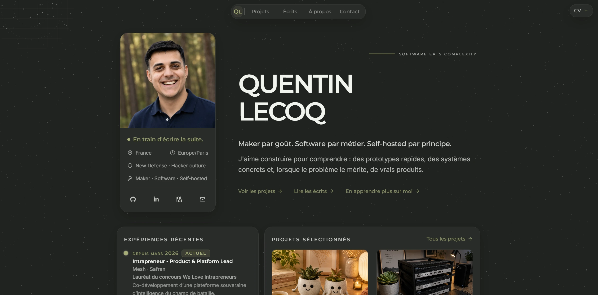
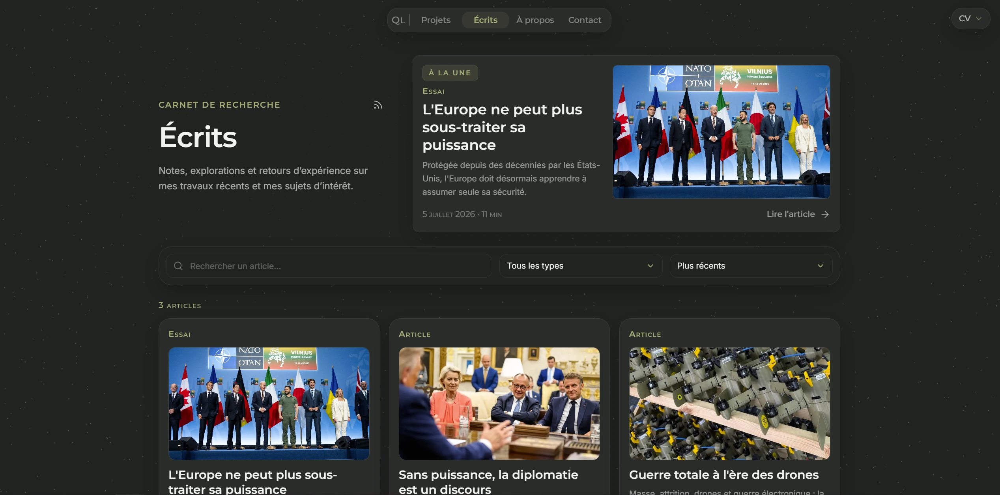
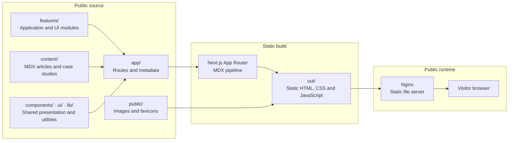

# 🧭 Quentin Lecoq Portfolio

[](https://nextjs.org/) [](https://www.typescriptlang.org/) [](https://tailwindcss.com/)  [](https://quentinlecoq.fr)

<p align="center">
  <a href="https://quentinlecoq.fr">
    
  </a>
</p>

A statically exported, MDX-powered editorial portfolio and publishing
platform built with Next.js.

This repository powers [quentinlecoq.fr](https://quentinlecoq.fr), bringing
together professional experience, projects, and long-form writing in a
restrained editorial interface.

The site uses the Next.js App Router and produces a fully static export. It
requires no backend, CMS, or database.

> This GitHub repository is an automatically synchronized public export of
> the primary private Gitea repository. It contains the curated source code
> and public content used to build the website.

## 👀 Preview

### Writing and research

<p align="center">
  <a href="https://quentinlecoq.fr/blog/">
    
  </a>
</p>

The website combines portfolio pages, project case studies, and long-form editorial content managed through MDX.

## ✨ Features

- about, projects, blog, and contact pages;
- editorial content and case studies written in MDX;
- route-aware metadata, structured data, sitemap, robots, and RSS feed;
- frontmatter validation with Zod;
- responsive WebP variants generated locally at build time;
- static export deployable with Nginx and Docker;
- optional Umami analytics configured at build time.

## 🧱 Stack

- Next.js 15, React 19, and TypeScript 5;
- Tailwind CSS 4 for styling;
- MDX for long-form content;
- Vitest and Testing Library for tests;
- Playwright for end-to-end tests;
- pnpm and Make for project commands.

## 🏗️ Public architecture



## 🧰 Requirements

- Git and Make;
- Node.js 22, tested with `22.20.0`;
- pnpm 10, tested with `10.28.0`;
- Docker with the Compose plugin, only for previewing the production image.

The expected versions are also declared in `.nvmrc`, `package.json`, and the
`Makefile`.

## 🚀 Setup

After cloning the repository:

```bash
cd portfolio
make install
make run
```

The development server is available at
[`http://localhost:3008`](http://localhost:3008). The port can be overridden:

```bash
make run DEV_PORT=3010
```

Local configuration is optional. Copy `.env.example` to `.env` to customize
public profile links, the contact address, or enable Umami:

```bash
cp .env.example .env
```

`NEXT_PUBLIC_*` variables are embedded in the static export at build time.
Changing them therefore requires a new build.

## 🧭 Main commands

| Command           | Purpose                                                  |
| ----------------- | -------------------------------------------------------- |
| `make run`        | Start the development server on port `3008`.             |
| `make build`      | Generate image variants and the static site in `out/`.   |
| `make test`       | Run unit and integration tests.                          |
| `make check-fast` | Run lint, typecheck, tests, and architecture guardrails. |
| `make check`      | Add the format check and production build.               |
| `make docker-up`  | Build and start the production image on port `3009`.     |
| `make help`       | Display all available commands.                          |

## 🗂️ Project structure

```text
app/          Next.js App Router routes and wiring
components/   Presentational components
content/      MDX articles, legal pages, and case studies
features/     Feature-first application modules
lib/          Shared configuration and utilities
public/       Images, favicons, and static documents
tests/        Unit, integration, UI, and end-to-end tests
ui/           Cross-feature UI primitives
```

The project favors Server Components. Client Components are limited to small
interactive islands, and routes under `app/` contain page wiring only.

## 🤝 Contributing

Issues, suggestions, and pull requests are welcome.

This GitHub repository is a synchronized public mirror. Accepted changes are
manually integrated into the primary Gitea repository and then republished
here.

See [`CONTRIBUTING.md`](CONTRIBUTING.md) for setup instructions, project
conventions, and contribution guidelines.

## ⚖️ License

This repository uses a mixed licensing model:

- the source code is released under the MIT License; see [`LICENSE`](LICENSE);
- original writing, articles, biographical data, résumé content, photographs,
  illustrations, and other original content remain the property of Quentin
  Lecoq; see [`CONTENT-LICENSE.md`](CONTENT-LICENSE.md).

Third-party materials remain subject to the rights and licenses of their
respective owners.
